# Flow Scanner User Guide

The **Flow Scanner** is a powerful tool built into Salesforce Inspector Reloaded that helps you analyze Salesforce Flows for best practices, errors, and potential issues. This guide explains how to use the Flow Scanner, what to expect, and how to get the most out of your flow analysis.

---

## What is the Flow Scanner?

The Flow Scanner automatically reviews your Salesforce Flows and checks them against a set of rules and best practices. It helps you:

- Identify errors, warnings, and improvement opportunities in your flows
- Understand where issues are located and what they mean
- Export scan results for documentation or sharing

**Built on Lightning Flow Scanner Core**

The Flow Scanner in Salesforce Inspector Reloaded is powered by the [Lightning Flow Scanner Core](https://github.com/Lightning-Flow-Scanner/lightning-flow-scanner-core), an open-source rule engine capable of conducting static analysis on Salesforce Lightning Flows, Process Builders, and Workflows. This core library provides the comprehensive rule definitions and scanning capabilities that make the Flow Scanner so powerful.

---

## How to Launch the Flow Scanner

1. **Open Salesforce Inspector Reloaded** in your browser (Chrome or Firefox).
2. Navigate to a Salesforce Flow in your org.
3. Look for the **Flow Scanner** button or option (usually available in the Inspector's UI when viewing a Flow):


4. Click the **Flow Scanner** button to open the scanner overlay.

---

## What Does the Flow Scanner Analyze?

- **Flow Metadata:** The scanner fetches the flow's structure, elements, and configuration directly from Salesforce.
- **Best Practice Rules:** It checks your flow against a set of rules (e.g., naming conventions, API version, complexity, missing fault paths, etc.).
- **Customizable Checks:** You can enable or disable specific rules in the Inspector's Options page under the Flow Scanner tab.

---

## Understanding the Scan Results

After scanning, you'll see a results panel with:

- **Summary Statistics:**
  - Total issues found
  - Number of errors, warnings, and informational messages
- **Detailed Results:**
  - Issues grouped by severity (Error, Warning, Info)
  - Each rule violation is listed with details about the affected flow element
  - Click on a rule or severity group to expand/collapse details

**Severity Levels:**
- **Error:** Critical issues that should be fixed
- **Warning:** Potential problems or risky patterns
- **Info:** Recommendations or minor suggestions

Exemple of a scan result:


**No Issues?**
- If your flow passes all checks, you'll see a success message: "No Issues Found. Great job!"

---

## Exporting Scan Results

You can export the scan results as a CSV file for documentation or sharing:

1. Click the **Export** button in the results summary panel.
2. The CSV file will be downloaded automatically, named with your flow's name and the current date.
3. Open the CSV in Excel, Google Sheets, or any spreadsheet tool to review or share the findings.

---

## Customizing Rules

- Go to the **Options** page of Salesforce Inspector Reloaded.
- Select the **Flow Scanner** tab.
- Enable or disable rules as needed, or adjust rule settings (like API version threshold or naming patterns).
- Re-run the scan for updated results.

Option page:


---

## Purging Old Flow Versions

Over time, flows can accumulate many stored versions in Salesforce. Flow Scanner includes a **Purge Old Versions** feature to help you clean up obsolete versions safely.

### What the Purge Feature Does

- Deletes **old, non-active versions** of the current flow.
- Optionally deletes any **Flow Interviews** (in-progress runs) related to those versions before removing the versions themselves.
- Uses the Salesforce **Composite API**, so multiple versions and interviews are deleted efficiently in batches.

### How to Use It

1. Open Flow Scanner on a specific flow.
2. In the **Flow Information** panel, look for the **Versions** value and the trash/bin button next to it.
   - The bin button only appears if the flow has **more than one version** (there is something to purge).
3. Click the bin button to open the **Purge Old Versions** dialog.
4. Choose the **number of previous versions to keep** (in addition to the current version).
5. Review the summary text telling you how many versions will be deleted and how many will be kept.
6. Confirm the purge.

Flow Scanner then:

- Finds all versions older than the ones you chose to keep (plus the active version) and marks them for deletion.
- Looks up and deletes related Flow Interviews for those versions.
- Deletes the old versions themselves using the Tooling API.
- Shows a **Purge Results** dialog with per-version status:
  - Version number
  - Flow status (Deleted/Failed)
  - Interviews deleted (or "No interviews" if none existed)
  - Any error message returned by Salesforce

### Version Limit & Color Indicator

Salesforce allows **up to 50 stored versions per flow**. To help you see how close you are to that limit, Flow Scanner displays the version count with a colored badge:

- **Green**: few versions stored (far from the limit).
- **Yellow/Orange**: moderate number of versions.
- **Red**: near the 50-version limit.

You can hover over the small **info icon** next to "Versions" to see a short explanation of the 50-version limit and what the badge color means.

Using the purge feature periodically helps keep your org clean and avoids hitting the maximum number of versions for critical flows.

---

## Accessibility & Shortcuts

- **Keyboard Navigation:**
  - Use <kbd>Tab</kbd> to move between buttons and sections
  - Press <kbd>Enter</kbd> or <kbd>Space</kbd> to expand/collapse result groups

---

## Technical Architecture

### How the Flow Scanner Page Works

The Flow Scanner follows a multi-step process to analyze your Salesforce Flows:

```mermaid
graph TD
    U[👤 User] --> |1. Opens Flow Scanner| EXT[🔧 S.I.R Extension<br/>• UI Layer<br/>• Configuration<br/>• Flow Processing]

    EXT --> |2. Metadata Request| REST[🌐 REST API<br/>/services/data/vXX.0/]
    EXT --> |3. Flow Definition<br/>Query| TOOL[🔧 Tooling API<br/>/services/data/vXX.0/tooling/]

    REST --> |API Call| SF[(🏢 Salesforce Org<br/>Flow Metadata<br/>XML Definitions)]
    TOOL --> |API Call| SF

    SF --> |4. XML Flow<br/>Metadata| EXT

    EXT --> |5. Flow XML Data| CORE[📚 Lightning Flow Scanner embedded lib<br/>• XML Parser<br/>• Rule Engine 20+ rules<br/>• Flow Analysis]

    CORE --> |6. Analysis Results| RES[📊 Scan Results<br/>• Error/Warning/Info<br/>• Rule Violations<br/>• CSV Export]

    RES --> |7. Formatted Results<br/>& Export Options| EXT
    EXT --> |8. Display Results| U

    %% Dark mode friendly styling
    classDef userClass fill:#4a90e2,stroke:#ffffff,stroke-width:2px,color:#ffffff
    classDef extensionClass fill:#8e44ad,stroke:#ffffff,stroke-width:2px,color:#ffffff
    classDef apiClass fill:#f39c12,stroke:#ffffff,stroke-width:2px,color:#000000
    classDef salesforceClass fill:#e67e22,stroke:#ffffff,stroke-width:2px,color:#ffffff
    classDef coreClass fill:#e74c3c,stroke:#ffffff,stroke-width:2px,color:#ffffff
    classDef resultClass fill:#27ae60,stroke:#ffffff,stroke-width:2px,color:#ffffff

    class U userClass
    class EXT extensionClass
    class REST,TOOL apiClass
    class SF salesforceClass
    class CORE coreClass
    class RES resultClass
```



### Data Flow Process

1. **Metadata Retrieval**

   GET `/services/data/vXX.0/tooling/sobjects/Flow/{FlowId}`
   → Returns Flow definition in XML format
2. **XML Processing**

   ```javascript
   // Lightning Flow Scanner Core processes the XML
   const flowObject = new Flow(xmlData);
   const scanResults = scanner.scan(flowObject, userConfig);
   ```

3. **Rule Execution**
   - Each enabled rule runs against the parsed Flow object
   - Rules check different aspects: elements, variables, metadata, connections
   - Results categorized by severity: Error, Warning, Info
4. **Result Presentation**
   - Results aggregated and displayed in interactive UI
   - Export functionality generates CSV reports
   - Users can expand/collapse rule categories

### API Integration Details

**Salesforce REST API Endpoints Used:**

- `/services/data/vXX.0/tooling/sobjects/Flow/` - Flow metadata retrieval
- `/services/data/vXX.0/tooling/query/` - SOQL queries for Flow information
- `/services/data/vXX.0/sobjects/` - Related object metadata when needed

**Authentication**: Leverages existing Salesforce Inspector session (handled globally by extension)

---

## Troubleshooting

- **No Rules Enabled:** If you see a message about no rules being enabled, open the Options page and enable at least one rule.
- **Initialization Error:** If the scanner fails to load, check your network connection and ensure you're logged into Salesforce.
- **Unsupported Flow Type:** Some flow types may not be supported. The scanner will list which types are supported if this occurs.
- **Still Stuck?** Check the browser console for errors or reach out to the extension's support channels.

---

## Tips & Best Practices

- Regularly scan your flows to catch issues early.
- Review errors and warnings before deploying flows to production.
- Use the export feature to document compliance or share findings with your team.
- Keep the extension updated for the latest rules and improvements.
