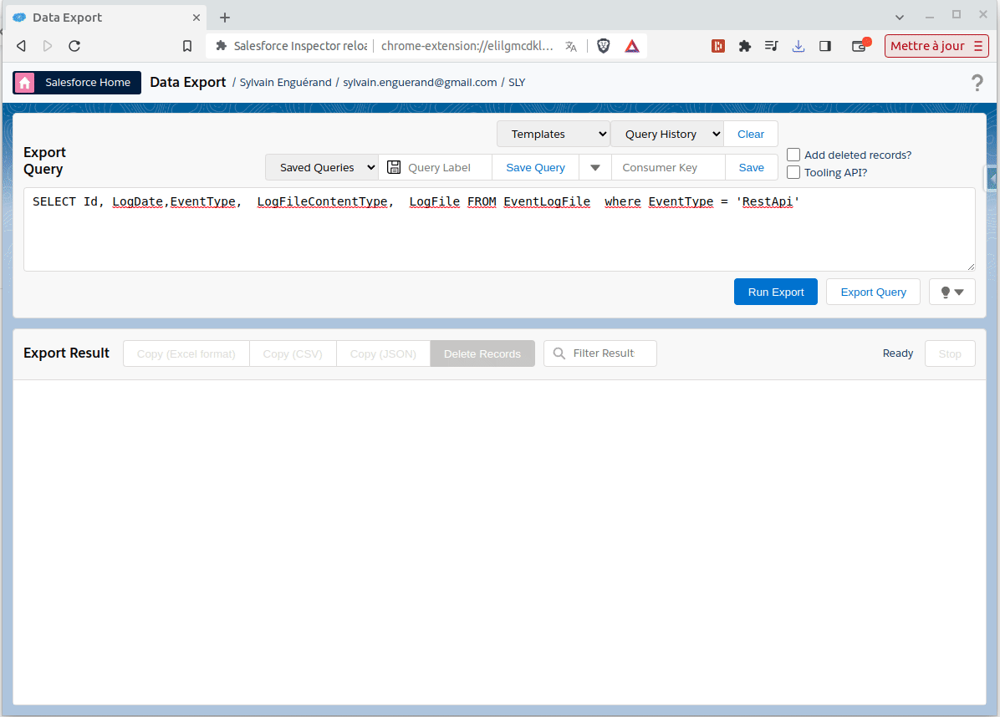

# How to

## Use Sf Inspector with a connected app

---

If you enabled "API client whitelisting", Sf Inspector may not work anymore.
To secure the extension usage, you can use a auth flow to get an access token linked to a connected app.

1. Create a connected app.
2. Set permissions and callback url. (chrome-extension://chromeExtensionId/data-export.html?host=mysandboxHost&)

   > **Warning**
   > Don't forget to replace "chromeExtensionId" and "mysandboxHost" with you current extension id and org domain
   > 

3. Get Consumer Key and save it in the export page

   

4. Refresh page and generate new token

   

## Migrate saved queries from legacy extension to Salesforce Inspector Reloaded

1. Open data export page on legacy extension
   
2. Get saved queries from `insextSavedQueryHistory` property
   
3. Open it in VS Code, you should have a JSON like this one:

   ```json
   [
     { "query": "select Id from Contact limit 10", "useToolingApi": false },
     { "query": "select Id from Account limit 10", "useToolingApi": false }
   ]
   ```

   From there you have two options

   Import the queries by adding a label for each one with the label in query property suffixed by ":"
   ie.

   ```json
   [
     {
       "query": "Contacts:select Id from Contact limit 10",
       "useToolingApi": false
     },
     {
       "query": "Accounts:select Id from Account limit 10",
       "useToolingApi": false
     }
   ]
   ```

Re-import this json in the new extension (with the same key `insextSavedQueryHistory`)

## Define a CSV separator

Add a new property `csvSeparator` containing the needed separator for CSV files

   

## Disable query input autofocus

Add a new property `disableQueryInputAutoFocus` with `true`


## Add custom query templates

Add a new property `queryTemplates` with your custom queries separated by "//" character.
Example:

`SELECT Id FROM// SELECT Id FROM WHERE//SELECT Id FROM WHERE IN//SELECT Id FROM WHERE LIKE//SELECT Id FROM ORDER BY//SELECT ID FROM MYTEST__c//SELECT ID WHERE`

## Open links in a new tab

If you want to _always_ open extension's links in a new tab, you can set the `openLinksInNewTab` property to `true`


If you want to open popup keyboard shortcuts, you can use the 'ctrl' (windows) or 'command' (mac) key with the corresponding key.
Example:

- Data <ins>E</ins>xport : e
- Data <ins>I</ins>mport : i
- Org <ins>L</ins>imits : l
- <ins>D</ins>ownload Metadata : d
- E<ins>x</ins>plore API : x

## Disable metadata search from Shortcut tab

By default when you enter keyword in the Shortcut tab, the search is performed on the Setup link shortcuts _AND_ metadata (Flows, PermissionSets and Profiles).
If you want to disable the search on the metadata, set `metadataShortcutSearch` to `false`


## Enable / Disable Flow scrollability

Go on a Salesforce flow and check / uncheck the checbox to update navigation scrollability on the Flow Builder


## Add custom links to "Shortcut" tab

Because one of the main use case for custom links is to refer to a record in your org, those links are stored under a property prefixed by the org host url.
You can find the value by checking the property `_isSandbox`


Then copy the url and add `_orgLinks` for the property name.
Now you can enter the custom links following this convention:

```json
[
  {
    "label": "Test myLink",
    "link": "/lightning/setup/SetupOneHome/home",
    "section": "Custom",
    "prod": false
  },
  {
    "label": "EnhancedProfiles",
    "section": "Custom",
    "link": "/lightning/setup/EnhancedProfiles/home",
    "prod": false
  }
]
```

ET VOILA !


## Enable summary view of PermissionSet / PermissionSetGroups from shortcut tab

Since Winter 24, there is a beta functionality to view a summary of the PermissionSet / PermissionSetGroups


You can enable this view for the Shortcut search by creating a new localVariable as shown below.


Then when you click on a PermissionSet / PermissionSetGroups search result, you'll be redirected to the summary.


## Download Event Log Files

Because it is not always easy to download event log files, you can now do it from the export option.
On each even log file, you can clic on the path and download the file:


