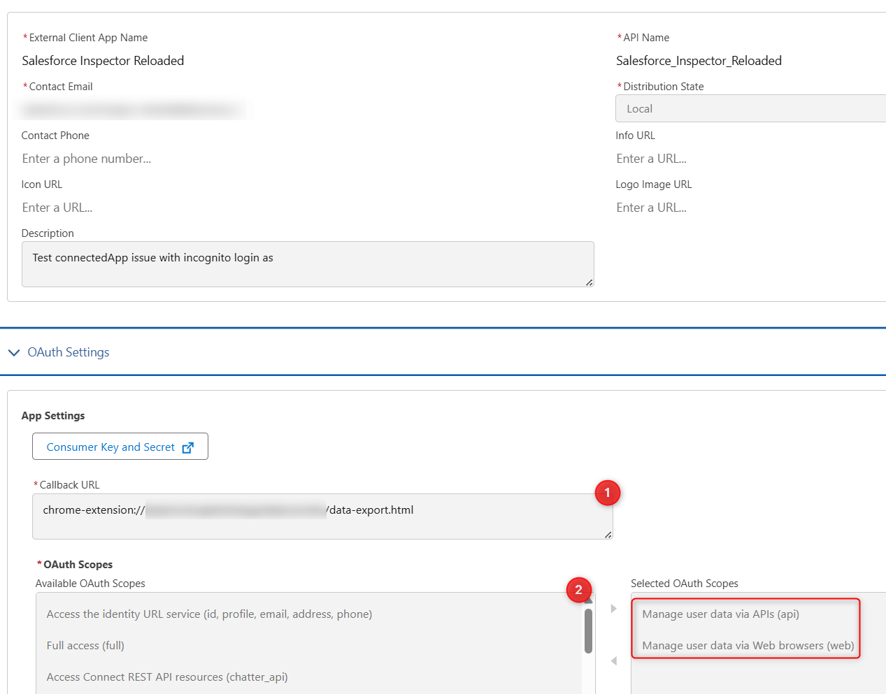

# How to

## Use Sf Inspector with a connected app

---

### For Chrome and Edge users

If you enabled "API client whitelisting" (a.k.a "API Access Control") in your org, SF Inspector may not work anymore.

To secure the extension usage, you can use a OAuth 2.0 flow to get an access token, linked to a connected app installed in your org.

1. Open the extension and scroll down to the "Generate Access Token" button.
2. You should see the "OAUTH_APP_BLOCKED" error which is normal at this stage.
3. Go to "Connected Apps OAuth Usage" in setup and search for "Salesforce Inspector reloaded".
4. Click "Install" and then confirm installation.
5. Now configure the profiles or permissions sets which will have the right to use the extension.
6. Go back to "Connected Apps OAuth Usage" and click "Unblock" next to "Salesforce Inspector reloaded"
7. Once again, open the extension and scroll down to the "Generate Access Token" button


This is it ! You can use the extension with the default connected app.

From now when the token will be expired, this banner will show up and provide a link to re-generate the access token


> **Warning**
> Don't forget to grant access to the users by selecting the related profile(s) or permission set(s).

If you are a Firefox user, or if you want to have full control over the connected app settings, you can also use your own external client app by following these instructions:

### External Client App Creation

The creation of Connected Apps is soon to be deprecated (planned for Spring 26'), so we will cover the creation of the new standard using an external Client App.

1. Navigate to Setup | External Client App > New External Client App.
2. Fill in the required details:
    * External Client App Name
    * Contact Email
    * Check `Enable OAuth` under the API (Enable OAuth Settings) accordion.
    * Set the Callback URL to `[browser]-extension://[extension-id]/data-export.html`, replacing [browser] with `chrome` or `moz` and [extension-id] with the extension ID found in the URL of any configuration page of the extension (e.g., by clicking `See All Data`).
3. Configure the OAuth Scopes:
    * Select `Manage user data via APIs (api)`.
    * Select `Manage user data via Web browsers (web)`.

    

    >**Warning**
    >If you don't select the `web` scope, you might not be able to use the Login As Incognito.
4. Configure Security settings:
   * **IMPORTANT: Deselect** (disable) `Require secret for Web Server Flow`.
   * Select (enable) `Require Proof Key for Code Exchange (PKCE) extension for Supported Authorization Flows`.
5. Get Consumer Key and save it in the Options page

    

6. Enter the consumer key

    

7. Refresh page and generate new token

    

## Migrate saved queries from legacy extension to Salesforce Inspector Reloaded

1. Open data export page on legacy extension
   
2. Get saved queries from `insextSavedQueryHistory` property
   
3. Open it in VS Code, you should have a JSON like this one:

   ```json
   [
     { "query": "select Id from Contact limit 10", "useToolingApi": false },
     { "query": "select Id from Account limit 10", "useToolingApi": false }
   ]
   ```

   From there you have two options

   Import the queries by adding a label for each one with the label in query property suffixed by ":"
   ie.

   ```json
   [
     {
       "query": "Contacts:select Id from Contact limit 10",
       "useToolingApi": false
     },
     {
       "query": "Accounts:select Id from Account limit 10",
       "useToolingApi": false
     }
   ]
   ```

Re-import this json in the new extension (with the same key `insextSavedQueryHistory`)

## Define a CSV separator

Add a new property `csvSeparator` containing the needed separator for CSV files

   


## Open links in a new tab

If you want to _always_ open extension's links in a new tab, you can enable> **Warning**


> **Warning**
   > Enabling this option will prevent you to use `Lightning navigation` which allows faster navigation.

- Data <ins>E</ins>xport : e
- Data <ins>I</ins>mport : i
- Org <ins>L</ins>imits : l
- <ins>D</ins>ownload Metadata : d
- E<ins>x</ins>plore API : x
- Event <ins>M</ins>onitor : m
- <ins>F</ins>ield Creator : f

## Disable metadata search from Shortcut tab

By default when you enter keyword in the Shortcut tab, the search is performed on the Setup link shortcuts _AND_ metadata (Flows, PermissionSets and Profiles).
If you want to disable the search on the metadata, update related option:


## Enable / Disable Flow scrollability

Go on a Salesforce flow and check / uncheck the checbox to update navigation scrollability on the Flow Builder


## Add custom links to "Shortcut" tab


You can add custom links to the "Shortcut" tab. These links will be stored in the `sfHost + "_orgLinks"` localStorage variable. The links are stored as a JSON array with the following properties:
- `label`: The label of the link
- `link`: The link to the page
- `section`: The section where the link will be displayed
- `isExternal`: A boolean indicating if the link is external (starts with 'http' or 'www')

The links are displayed in a table format with the following features:
- Sortable columns (click on column headers to sort)
- Search functionality to filter links by label, link, or section
- Edit and delete buttons for each link
- Add button to create new links

To add a new link:
1. Click the "+" button at the bottom of the table
2. Fill in the label, link, and section fields
3. Click the check icon to save or the X icon to cancel

To edit a link:
1. Click the edit icon (pencil) next to the link
2. Modify the fields
3. Click the check icon to save or the X icon to cancel

To delete a link:
1. Click the delete icon (trash) next to the link

To search links:
1. Use the search box at the top of the table
2. Type any text to filter links by label, link, or section
3. The table updates in real-time as you type

To sort links:
1. Click on any column header to sort by that column
2. Click again to reverse the sort order
3. The current sort column is indicated by an up/down arrow icon

The links are stored in the browser's localStorage, so they will persist between sessions. The links are specific to each org, so you can have different links for different orgs.


## Enable summary view of PermissionSet / PermissionSetGroups from shortcut tab

Since Winter 24, there is a beta functionality to view a summary of the PermissionSet / PermissionSetGroups


You can enable this view for the Shortcut search by enabling the option as shown below.


Then when you click on a PermissionSet / PermissionSetGroups search result, you'll be redirected to the summary.

## Customize Create / Update rest callout headers (to prevent execution of auto assignment rules for Accounts, Cases, or Leads)

[Assignment Rule Header](https://developer.salesforce.com/docs/atlas.en-us.api_rest.meta/api_rest/headers_autoassign.htm)

From the popup, click on "Options" button and select the API tab.


If you want to prevent auto assignment rules, set the `createUpdateRestCalloutHeaders` property to `{"Sforce-Auto-Assign" : false}`

## Update API Version

Since the plugin's api version is only updated when all productions have been updated to the new release, you may want to use the latest version during preview windows.

> [!IMPORTANT]
> When you manually update the API version, it won't be overridden by extension future updates.


## Delete All Apex Logs

Sometimes you need to purge the ApexLogs from you org, mostly when the maximum size limit is reached.
You can now delete all apex logs with a simple click. From the popup, select 'Org' tab and click 'Delete All ApexLogs' button.


## Enable debug logs

Sometimes you may want to enable logs for a particular user.
From User tab, click the "Enable Log" button.

By default, this will enable logs with level "SFDC_DevConsole" for 15 minutes.


You can update the debug level (configuration is per organization) and duration (for all organizations) on the Options page.


> **Warning**
> Increasing the default duration may lead to a high volume of logs generated.

## Enable Debug Mode (for Lightning Components)

Enable debug mode to make it easier to debug JavaScript code from Lightning components.
Warning: Salesforce is slower for users who have debug mode enabled.


## Customize extension's favicon

From the option page, you can customize the default favicon by:

- a predefined color name among [those values](https://www.w3schools.com/tags/ref_colornames.asp) or any HTML color code you want (ie `#FF8C00`).
- a custom favicon url (ie "https://stackoverflow.com/favicon.ico")

The customization is linked to the org, it means you can have different colors for DEV and UAT env for example.


Now if you want to populate all the orgs you visited with a custom favicon, you have two options:
- Smart mode enabled: this will analyze your environment name and populate a favicon based on this (blue for dev, green for int, purple for uat and orange for full)
- Random: this will choose a random color among all the predefined colors

Then you click on Populate All and that's it!
Note: orgs with an existing customized favicon won't be affected.

## Customize sandbox banner color

From the option page, enable "Use favicon color on sandbox banner"


## Customize extension's shortcuts

Navigate to [chrome://extensions/shortcut](chrome://extensions/shortcut) and choose dedicated shortcuts for the pages you want.


### Default shortcuts

If you want to open popup keyboard shortcuts, you can use the 'ctrl' (windows) or 'command' (mac) key with the corresponding key.
Example:

- Data <ins>E</ins>xport : e
- Data <ins>I</ins>mport : i
- Org <ins>L</ins>imits : l
- <ins>D</ins>ownload Metadata : d
- E<ins>x</ins>plore API : x

## Highlight PROD with a top border

Production environment are critical, to avoid confusion with other orgs, you can enable an option which will add a 2px border on the top of the Salesforce UI and also in the extension's pages.

Under `User Experience` tab, enable the option `Highlight PROD with a top border (color from favicon)`.


## Import / Export configuration (saved query etc.)

### With 1.25 and above
To export and import your current configuration, go to the options page and click the corresponding icon in the header:


## Hide some buttons in the popup

Since the extension offers more features, the number of button is increasing.
Some of the users may don't need some of those, to make the popup lighter some of the buttons can be hidden:


## Switch user language from the popup

From the User tab in the popup, click on the user language flag to display the available languages.


## Default Popup Tab
You can configure which tab should be selected by default when opening the popup. To do this:
1. Open the options page
2. Go to the "User Experience" tab
3. Find the "Default Popup Tab" option
4. Select your preferred tab:
   - Object: Shows the SObject search and details
   - Users: Shows the user search and details
   - Shortcuts: Shows your configured shortcuts
   - Org: Shows organization information

The selected tab will be remembered and used as the default when opening the popup.

## Customize User Tab Search Filters and Fields

The User tab in the popup allows you to search for users across your Salesforce org. You can customize both the search fields used and apply filters to exclude certain types of users from the search results.


### Configuring Search Fields

By default, user searches look through Username, Email, Alias, and Name fields. You can customize which fields are searched by:

1. Open the extension and click the "Options" button
2. Navigate to the "User Experience" tab
3. Find the "User Default Search Fields" section
4. Check/uncheck the fields you want to include in searches:
   - **Username** - The user's unique username (default: enabled)
   - **Email** - The user's email address (default: enabled)
   - **Alias** - The user's alias (default: enabled)
   - **Name** - The user's full name (default: enabled)
   - **Profile Name** - Search by the user's profile name (default: disabled)

The search placeholder text in the User tab will automatically update to reflect which fields are currently enabled for searching.

### Applying Search Filters

You can exclude certain types of users from appearing in search results:

1. In the same "User Experience" tab in Options
2. Find the "Exclude users from search" section
3. Enable the filters you want to apply:
   - **Exclude Portal users** - Hides users who have portal access enabled
   - **Exclude Inactive users** - Hides users who are marked as inactive

## Generate a package.xml from a deployment

From a	DeployRequest record, click on the `Generate package.xml` button to download the package.xml for this deployment.
> [!NOTE]
> If you retrieve the related metadata it may have been modified since the deployment, so you are not sure to retrieve what was deployed.


## Perform a field usage analysis for an SObject

The field usage analysis feature helps you understand which fields in your Salesforce org are actually being used by calculating the percentage of records that have values for each field.

### How to use

1. **Navigate to an SObject**: Select an SObject from the popup or navigate to any SObject page in Salesforce
2. **Open Show All Data**: Click the "Show all data" button to open the field inspection page
3. **Calculate Field Usage**: You have two options:
   - **Individual field**: Click on "Get field usage" link next to any field to calculate usage for that specific field only
   - **All fields**: Click on the refresh icon (🔄) in the "Usage (%)" column header to calculate usage for all fields at once
4. **View Results**:
   - Hover over any percentage to see the detailed breakdown (e.g., "1,247 / 5,000 records (25%)")
   - Required fields automatically show 100% usage
   - Fields that can't be analyzed (like textarea or address fields) will be empty
5. **Export Results**: Use the table settings menu (gear icon) to copy the table or download as CSV

### Important Notes

> **Warning**
> Field usage analysis uses Salesforce API calls and counts against your API request limits. For large orgs, consider using this feature in a copy of production to avoid hitting API limits.

- The feature uses Composite API to efficiently batch multiple field queries
- Loading indicators show when calculations are in progress
- Results are cached during your session for better performance
- Required fields (nillable = false) automatically show 100% usage without making API calls

### Use Cases

This feature is particularly useful for:
- Data cleanup projects
- Field deprecation planning
- Org optimization initiatives
- Documentation and audit requirements
- Understanding field adoption across your organization

