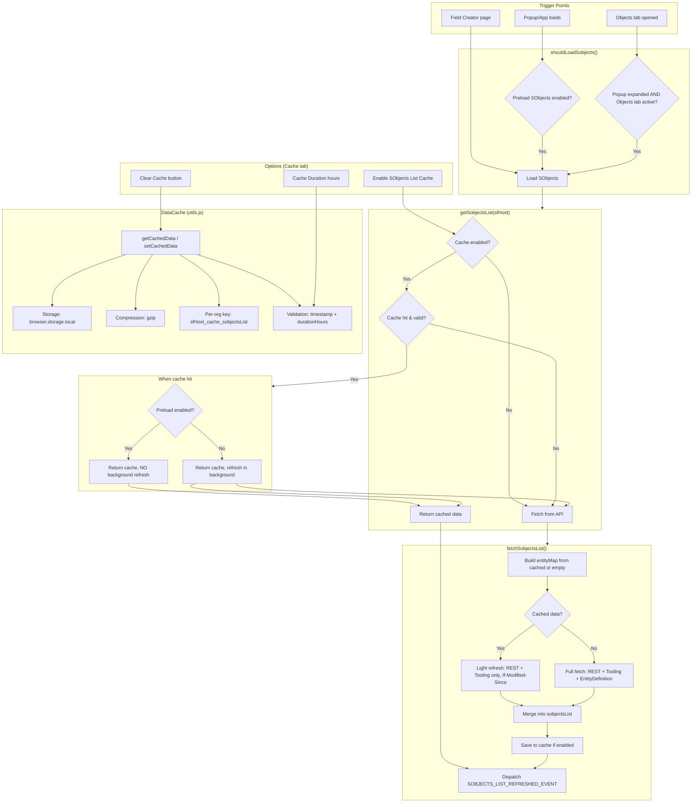

# SObject Cache Management — Flow Diagram & Architecture

This document describes the SObject list cache management, the high-level SObject retrieval flow, and how settings control the behavior.

---

## High-Level Overview

The extension caches the **SObjects list** (metadata about all Salesforce objects) to improve popup loading performance. The cache stores object metadata (name, label, keyPrefix, etc.) so the extension avoids repeated API calls when you open the popup or switch between orgs.

**Key data sources merged into the SObjects list:**
- **REST API** `/sobjects/` — standard describe global
- **Tooling API** `/tooling/sobjects/` — tooling describe global  
- **EntityDefinition** — Tooling API query for labels, keyPrefix, layoutable, etc.

---

## Settings & Their Role

| Setting                                  | Storage Key                  | Default                                  | Effect                                                                                                                                                                       |
|------------------------------------------|------------------------------|------------------------------------------|------------------------------------------------------------------------------------------------------------------------------------------------------------------------------|
| **Enable SObjects List Cache**           | `enableSobjectsListCache`    | `true`                                   | When enabled, the SObjects list is cached. When disabled, every request fetches from the API.                                                                                |
| **Preload SObjects before popup opens**  | `preloadSobjectsBeforePopup` | `true`                                   | When enabled, loads SObjects (from cache or API) as soon as the popup page loads, even before the user expands it. When disabled, loads only when the Objects tab is active. |
| **SObjects List Cache Duration (hours)** | `cacheDuration_sobjectsList` | `8` (UI default) / `168` (code fallback) | How long a cache entry is considered valid. After expiry, the next request fetches fresh data.                                                                               |
| **Clear Cache** (button)                 | —                            | —                                        | Manually clears the SObjects list cache for the current org.                                                                                                                 |

**Settings interconnection:**
- **Preload ON + Cache ON:** Uses cache immediately when popup loads; no background refresh (list is already fast).
- **Preload OFF + Cache ON:** Uses cache when Objects tab is opened; refreshes in background (with `If-Modified-Since`) to get updates.
- **Cache Duration:** Used when creating cache entries and when validating if a cache entry is still valid.

---

## Flow Diagram



---

## SObject Retrieval Flow (Step by Step)

### 1. When is SObjects list requested?

- **Popup (AllDataBox):** When `shouldLoadSobjects()` is true:
  - Popup expanded + Objects tab active, or
  - Preload enabled + popup not expanded (loads before user opens it)
- **Field Creator:** When the page loads and needs layoutable objects

### 2. `getSobjectsList(sfHost)`

1. Check `enableSobjectsListCache` (default: true).
2. If cache disabled → fetch from API, return result.
3. If cache enabled → try `DataCache.getCachedData(CACHE_SOBJECTS_LIST, sfHost, true, true)`.
4. **Cache miss or expired** → `fetchSobjectsList(...)` and return.
5. **Cache hit:**
   - If **Preload enabled** → return cached data, no background refresh.
   - If **Preload disabled** → return cached data and call `fetchSobjectsList` in background (with `lastFetch` for `If-Modified-Since`).

### 3. `fetchSobjectsList(...)`

1. Build `entityMap` from cached list (if any) or empty.
2. **If cached data exists:** Only REST + Tooling `/sobjects/` with `If-Modified-Since: lastFetch` (light refresh).
3. **If no cache:** Full fetch:
   - REST `/sobjects/`
   - Tooling `/tooling/sobjects/`
   - EntityDefinition query (batched)
4. Merge all into `sobjectsList`.
5. If cache enabled → `DataCache.setCachedData(...)` with gzip compression.
6. Dispatch `SOBJECTS_LIST_REFRESHED_EVENT` so UI can update.

### 4. Cache storage (DataCache)

- **Key:** `{sfHost}_cache_sobjectsList` (per org)
- **Storage:** `browser.storage.local` (large data)
- **Compression:** gzip (base64)
- **Validation:** `timestamp` + `durationHours` (from `cacheDuration_sobjectsList`)
- **Org switch:** Old org cache is evicted when storage is near quota; different-org order by last fetch date entries are removed first.

---

## Connection Between Settings

```
┌─────────────────────────────────────────────────────────────────────────┐
│                         OPTIONS PAGE (localStorage)                       │
├─────────────────────────────────────────────────────────────────────────┤
│  "API" tab:                                                               │
│    • Preload SObjects before popup opens  → preloadSobjectsBeforePopup   │
│                                                                          │
│  "Cache" tab:                                                             │
│    • Enable SObjects List Cache toggle    → enableSobjectsListCache      │
│    • Cache Duration (hours)              → cacheDuration_sobjectsList   │
│    • Clear Cache button                   → DataCache.clearCache()       │
└─────────────────────────────────────────────────────────────────────────┘
                                    │
                                    ▼
┌─────────────────────────────────────────────────────────────────────────┐
│                         RUNTIME BEHAVIOR                                  │
├─────────────────────────────────────────────────────────────────────────┤
│  preloadSobjectsBeforePopup:                                              │
│    • Used by: popup.js shouldLoadSobjects()                               │
│    • Effect: Load SObjects when popup page loads vs only when Objects tab │
│                                                                          │
│  enableSobjectsListCache:                                                 │
│    • Used by: utils.js getSobjectsList(), fetchSobjectsList()             │
│    • Effect: Use cache vs always fetch from API                           │
│                                                                          │
│  preloadSobjectsBeforePopup + enableSobjectsListCache (when cache hit):   │
│    • Preload ON  → return cache, no background refresh                    │
│    • Preload OFF → return cache, refresh in background (If-Modified-Since)│
│                                                                          │
│  cacheDuration_sobjectsList:                                              │
│    • Used by: DataCache.getCacheDurationHours(), isCacheValid()           │
│    • Effect: Cache entry validity (hours until considered expired)        │
└─────────────────────────────────────────────────────────────────────────┘
```

---

## Recommended Settings

| Scenario                                     | Preload | Cache | Duration      |
|----------------------------------------------|---------|-------|---------------|
| Fast popup, context detection on hover       | ON      | ON    | 8h            |
| Less API usage, refresh when opening Objects | OFF     | ON    | 168h (7 days) |
| Always fresh data, no cache                  | —       | OFF   | —             |
