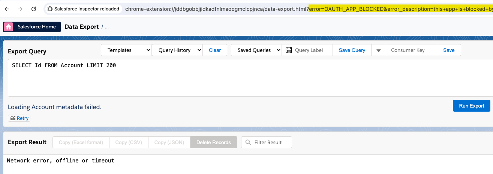

# Troubleshooting

## Common issues that may occurs

### Blank popup

You've just installed Salesforce Inspector Reloaded and ... the popup is blank 😥
Make sure that third party cookies are enabled in your browser:


### Salesforce Inspector Reloaded is not working anymore

One of the cause can be a domain update (Hyperforce migration, MyDomain change ...).
What you need to do is to delete the sid cookie (and website associated cookies if sid did not worked).


### Unauthorized or Network error

If your are getting an "Unauthorized" or "Network error" while online, it is likely caused by an authentication issue.
To troubleshoot, clean Local Storage, and then try to reauthenticate in the extension, by clicking the "Click here to generate new token" button, or the "Generate Access Token" button.

When redirected to the "Data Export" tab at the end of the OAuth flow, check the URL parameters in your address bar: if it contains `error=OAUTH_APP_BLOCKED&error_description=this+app+is+blocked+by+admin` this means that your org has API Access Control enabled. In that situation, you must ask your Salesforce admin to install and allow the Salesforce Inspector Connected App before you can use it.



### Generate new token error

If you did not enabled 'API Access Control' and continuously see the banner generate token.

You may have seen this message because of an expired token, and since this was the only available option clicked on 'Generate new Token'.

Delete the generated token from the Option page


Or try to run this code in chrome dev console, after inspecting the extension' popup code:

```js
let tokens = Object.keys(localStorage).filter((localKey) =>
  localKey.endsWith("access_token")
);
tokens.forEach((element) => localStorage.removeItem(element));
```

Still facing the issue ? Try to connect to your org in an anonymous window (make sure you allowed the extension to run in private mode).
If the error disappeared, clear site data to solve the issue in normal navigation.

### Managed Application Installation Error

When installing the default connected app when `API Access Control` is enabled, if you face the error `Managed Application Installation Error` you may have an existing connected app named `Salesforce Inspector reloaded`.

### Logging as incognito issue with ConnectedApp

When using the default Connected App and clicking the `Generate New Token` button, it is possible that the `LoginAs Incognito` mode will no longer function as expected, and you will be redirected to a login page instead of being automatically logged in.


This issue stems from the standard Salesforce Inspector Reloaded Connected App, which does not utilize the correct OAuth scope. As a workaround, you can create a custom `External Client App` (since the creation of Connected Apps is soon to be deprecated).

To create a custom `External Client App`, follow these [steps](https://tprouvot.github.io/Salesforce-Inspector-reloaded/how-to/#for-firefox-users).

 